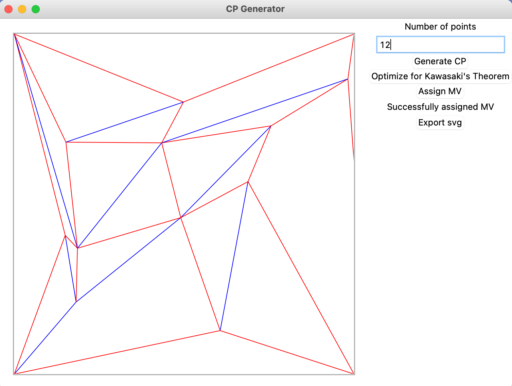

# Crease Pattern Generator

This project is an implementation of [[Mitani 2011]](https://citeseerx.ist.psu.edu/document?repid=rep1&type=pdf&doi=285c77274d592f20a3b6d518e1bfae146c8c7632) in python with a fairly bare bones tkinter interface. It is still in progress, but functionality is there.

Besides providing the only publicly available implemenation of the algorithm I am aware of, two improvements were made upon the method.

Firstly, Mitani did not prove that the edge-removing procedure in step 3 would always succeed. We provide a simple extension of their method that always succeeds: First, by the handshaking lemma, there are an even number of odd-degree vertices. Furthermore, removing a path between two odd-degree vertices turns both of them into even-degree vertices while preserving the parity of all other vertices. Thus, by removing paths between pairs of odd-vertices, we will be left with a graph where all vertices are even-degree. This observation was made in conjunction with Matthew Li.

Secondly, Mitani uses a brute-force search to find mountain-valley assignment which satisfies Maekawa's Theorem. We improve slightly upon this procedure, by adapting the procedure in [[Bern and Hayes 1996]](http://graphics8.nytimes.com/packages/blogs/images/BernHayes-1.origami.SODA96.pdf).

Here is what the tkinter interface looks like as of now:

I ran a hundred trials for each number of vertices, and it seems that the success rate quickly drops the more vertices you add. The max iterations I set in these trials was 100, and iterating more times does result in a higher success rate, but it does take longer (you can press the button multiple times in the tkinter face to keep on optimizing).

| Number of Vertices| 1 | 2 | 3 | 4 | 5 | 6 | 7 | 8 | 9 | 10 | 11 |
| :---: | :---: | :---: | :---: | :---: | :---: | :---: | :---: | :---: | :---: | :---: | :---: |
| Success Rate | 100% | 96% | 49% | 43% | 44% | 32% | 31% | 20% | 13% | 10% | 6% |

# Citations
Bern, Marshall, and Barry Hayes. "The complexity of flat origami." In SODA, vol. 96, pp. 175-183. 1996.

Mitani, Jun. "A method for designing crease patterns for flat-foldable origami with numerical optimization." Journal for Geometry and Graphics 15, no. 2 (2011): 195-201.

# Examples

Here is one sample of folding one of these randomly generated crease patterns. A lot of the folding patterns feel unfamiliar, really helps (slightly) expand your idea of how to fold things!

